# DPO-RNA — Master EDA Report

This report aggregates per-split EDA for **MFE**, **pLDDT**, and **RMSD**.

**Sign conventions:**

- MFE: more negative is better → negative Δ (winner - loser) means winner better.
- pLDDT: higher is better → positive Δ means winner better.
- RMSD: lower is better → negative Δ means winner better.

## Clean pair counts

| split | clean_pairs |
|---|---:|
| train | 20811 |
| val | 505 |
| test | 429 |

## Train summary

### train — summary stats

| metric | winner_mean | winner_median | loser_mean | loser_median | delta_mean | delta_median |
|---|---:|---:|---:|---:|---:|---:|
| mfe | -34.11 | -36.1 | -27.79 | -30 | -6.322 | -5.3 |
| plddt | 0.7891 | 0.7862 | 0.6555 | 0.6983 | 0.1336 | 0.1008 |
| rmsd | 3.388 | 2.996 | 9.685 | 8.603 | -6.297 | -4.918 |

## Val summary

### val — summary stats

| metric | winner_mean | winner_median | loser_mean | loser_median | delta_mean | delta_median |
|---|---:|---:|---:|---:|---:|---:|
| mfe | -11.92 | -12.4 | -7.94 | -7.7 | -3.981 | -2.9 |
| plddt | 0.8051 | 0.8113 | 0.6842 | 0.745 | 0.1209 | 0.0653 |
| rmsd | 3.271 | 2.991 | 6.759 | 4.619 | -3.487 | -2.396 |

## Test summary

### test — summary stats

| metric | winner_mean | winner_median | loser_mean | loser_median | delta_mean | delta_median |
|---|---:|---:|---:|---:|---:|---:|
| mfe | -25.08 | -26.3 | -18.66 | -19.1 | -6.415 | -5.5 |
| plddt | 0.7667 | 0.7683 | 0.595 | 0.612 | 0.1717 | 0.1636 |
| rmsd | 3.613 | 3.381 | 11.48 | 9.482 | -7.867 | -5.876 |

## Delta distributions & winner fractions

### mfe Δ (winner - loser)
More negative MFE (lower) is better (thermostability). Thus negative Δ = winner better.

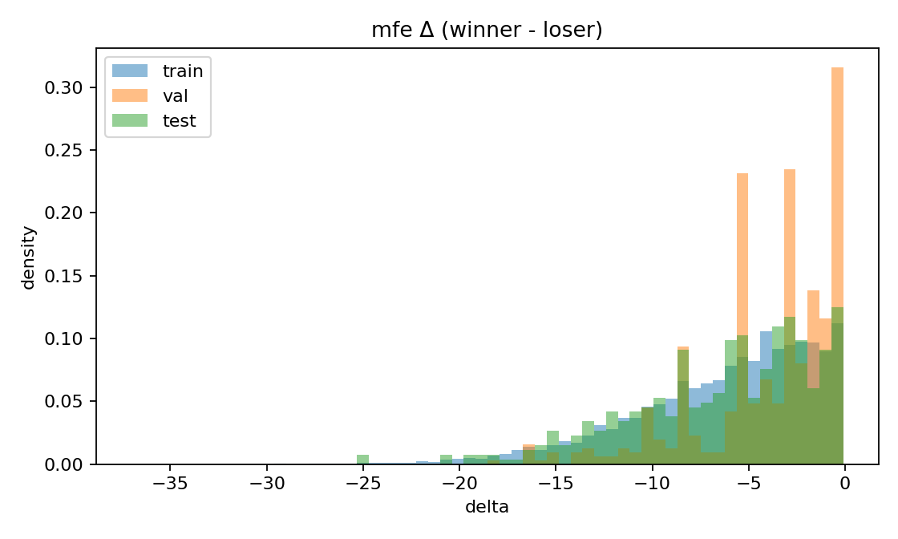

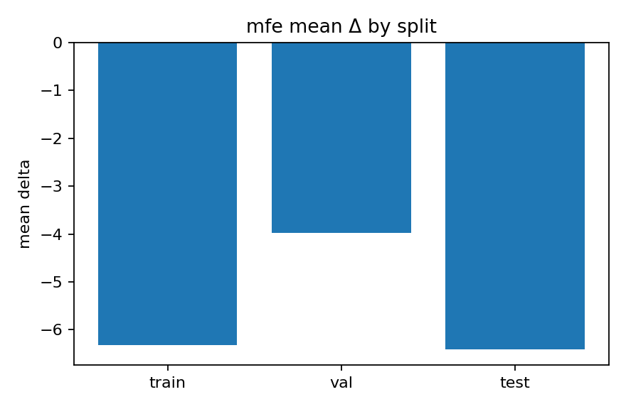

### plddt Δ (winner - loser)
Higher pLDDT is better (confidence). Thus positive Δ = winner better.

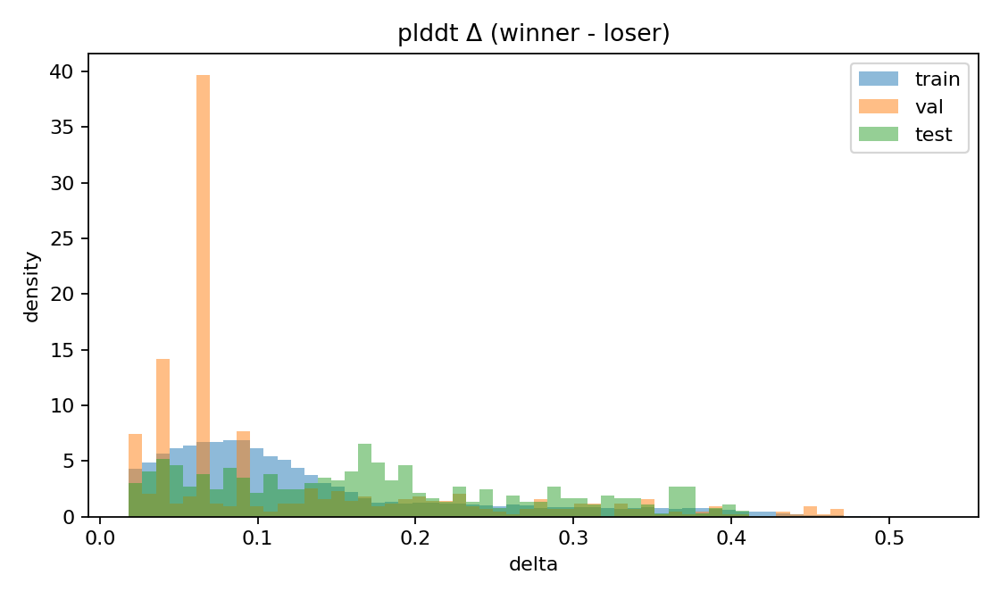

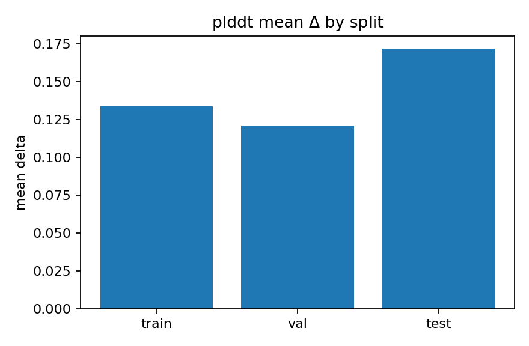

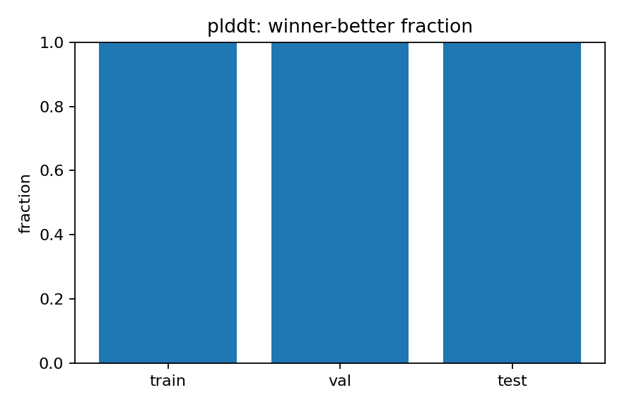

### rmsd Δ (winner - loser)
Lower RMSD is better (closer to native). Thus negative Δ = winner better.

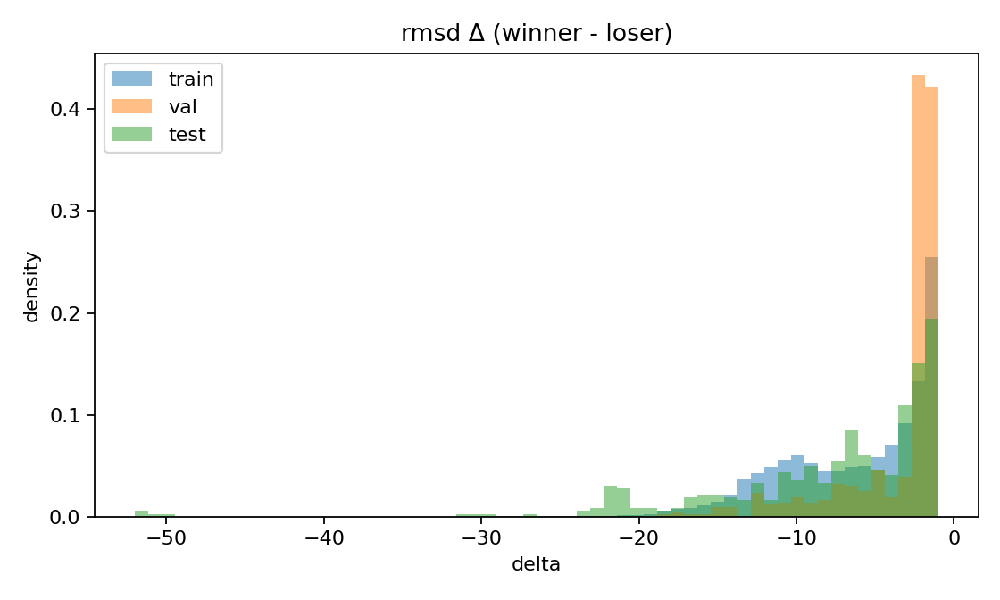

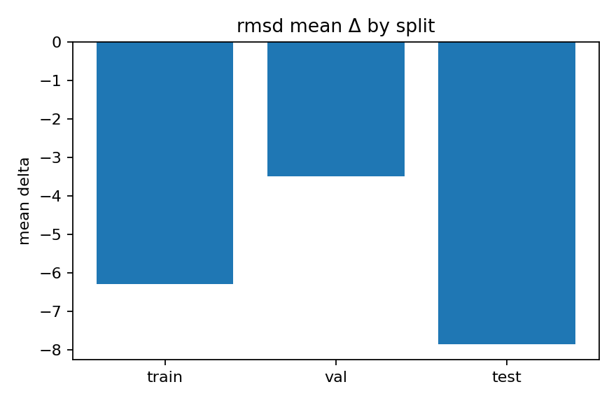

## Coverage (clean pairs per backbone)

### train

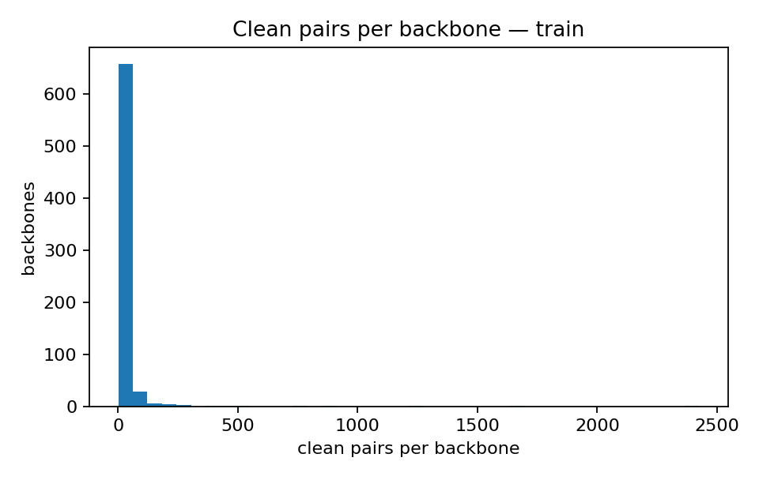

### val

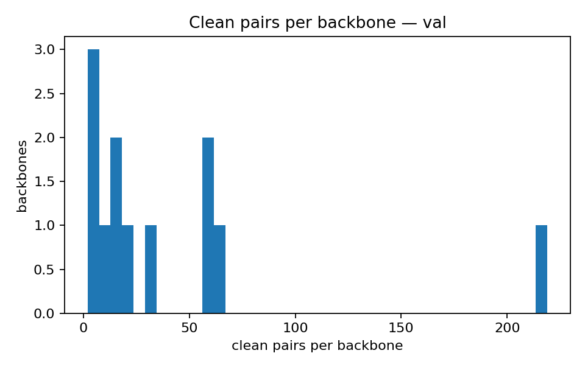

### test

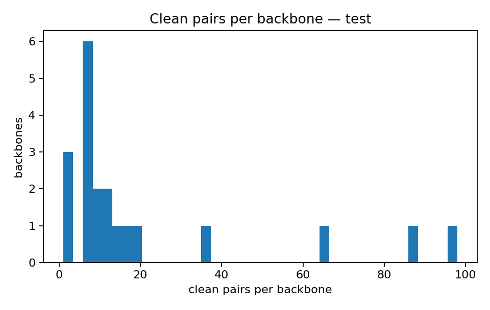

## Length distributions

### train — graph length

### train — clean sequence length

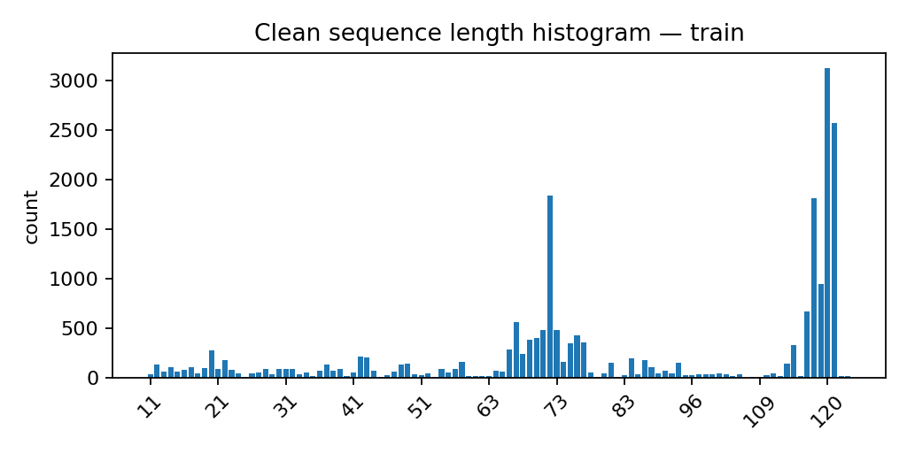

### val — graph length

### val — clean sequence length

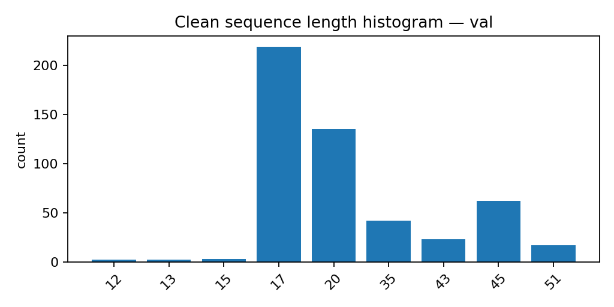

### test — graph length

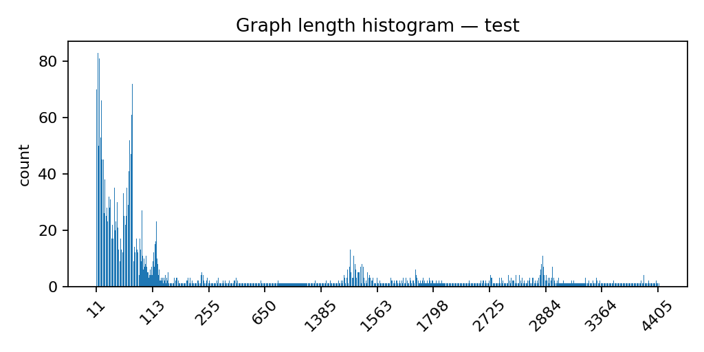

### test — clean sequence length

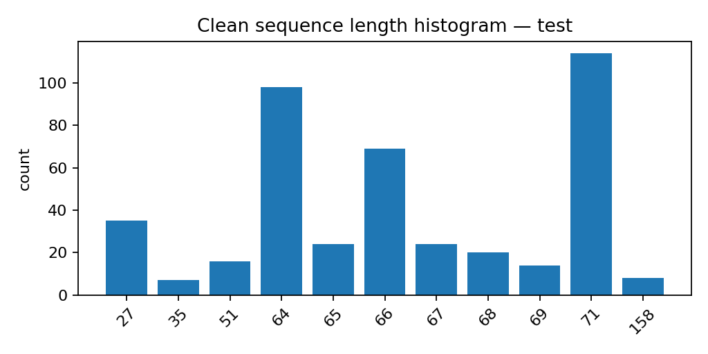

## Interpretation (automatic)

**mfe** — mean Δ (train/val/test): -6.322, -3.981, -6.415; median Δ: -5.3, -2.9, -5.5.
Winners are more stable (more negative MFE) across splits.

**plddt** — mean Δ (train/val/test): 0.1336, 0.1209, 0.1717; median Δ: 0.1008, 0.0653, 0.1636.
Winners have higher pLDDT (structure confidence).

**rmsd** — mean Δ (train/val/test): -6.297, -3.487, -7.867; median Δ: -4.918, -2.396, -5.876.
Winners are closer to native (lower RMSD).
